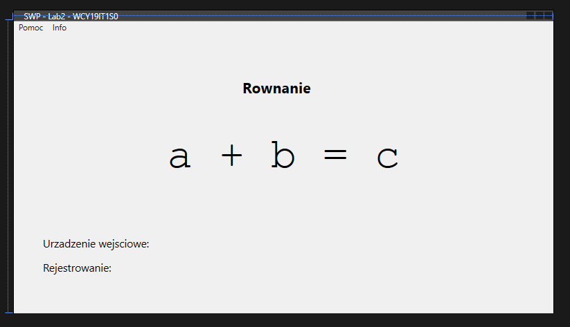

# Laboratorium nr 2

## *Asystent głosowy o funkcji kalkulatora prostego - GUI*

## Zadanie

### Treść

Stworzyć oprogramowanie prototypu głosowego systemu dialogowego zdolnego do wykonywania prostych operacji matematycznych (dodawanie, odejmowanie, mnożenie i dzielenie).
System rozpoznaje podane przez użytkownika dwie liczby całkowite i rodzaj operacji, którą następnie wykonuje i zwraca wynik.

Oprogramowanie należy zrealizować jako aplikację desktopową z graficznym interfejsem użytkownika (GUI).

### Interfejs Użytkownika

> *Zrzut ekranu z modułu **Design** ze środowiska **Visual Studio***

### Format wiadomości

Użytkownik podaje polecenie zgodnie z ustalonym formatem wiadomości.

**`NUM_1` | `OP` | `NUM_2` | `CMD_EXEC`**

gdzie:

`NUM_x` : liczba całkowita nr *x*

`OP` : Rodzaj operacji - jedno z <*dodać / plus, odjąć / minus, razy / pomnożyć / podzielić*>

`CMD_EXEC`: Komenda wykonania obliczeń - <*wykonaj*>

Po zadanym poleceniu system wykonuje działanie zdefiniowane w `OP` na liczbach `NUM_1` i `NUM_2` oraz zwraca wynik operacji lub informuje o błędzie operacji, np. w przypadku polecenia dzielenia przez 0.

### Inne polecenia

Poza określonym powyżej poleceniem użytkowik może wydać jeszcze dwa inne polecenia pomocnicze:

`CMD_CLS` : Komenda czyszczenia : aplikacja czyści interfejs z poprzedniego działania - <*wyczyść*>

---

## Realizacja

### Technologia

W celu realizacji zadania laboratoryjnego wykorzystano język programowania **C#** do wytworzenia aplikacji **WPF** we współpracy z framework'iem **.NET 4.7.2**.

Do operacji rozpoznawania i syntezy mowy wykorzystano **Microsoft Speech Platform**.

### Kod źródłowy

Zbudowano rozwiązanie Visual Studio: [`SwpLab`](SwpLab/).

W ramach rozwiązania utworzono projekt: [`Lab2`](SwpLab/Lab2/).
